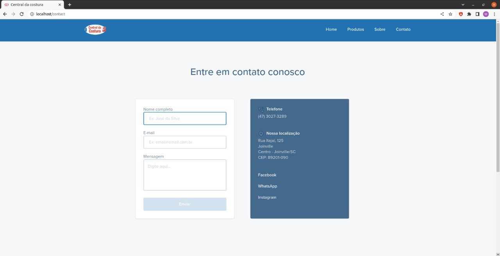

# Sewing Center store
> Website of the sewing center store, where the clients can reach all the information of the store, and the owner can manage the website with the CMS

## Table of Contents
* [General Info](#general-information)
* [Technologies Used](#technologies-used)
* [Screenshots](#screenshots)
* [Setup](#setup)

## What does the website provide?
- Products and categories list
- Information about the store
- Contacts form and e-mail seender
- Administration of the products, categories and users

## Technologies Used
- Php 8.1
- Laravel 9
- Docker settend by laravel sail
- Mysql
- Bootstrap

## Screenshots
Pages made

## Setup
You can install the application with xamp or lamp, but since the application was developed with Laravel Sail, you can install everything using docker. 
In case you allready have docker installed at your computer, you can follow those steps: 
After clone the project, run the install command from the Terminal:

    ./vendor/bin/sail up -d

Run the migration command and populate your tables

    ./vendor/bin/sail php artisan migrate

    ./vendor/bin/sail php artisan migrate:fresh --seed

Now you're ready to start using sewing center.